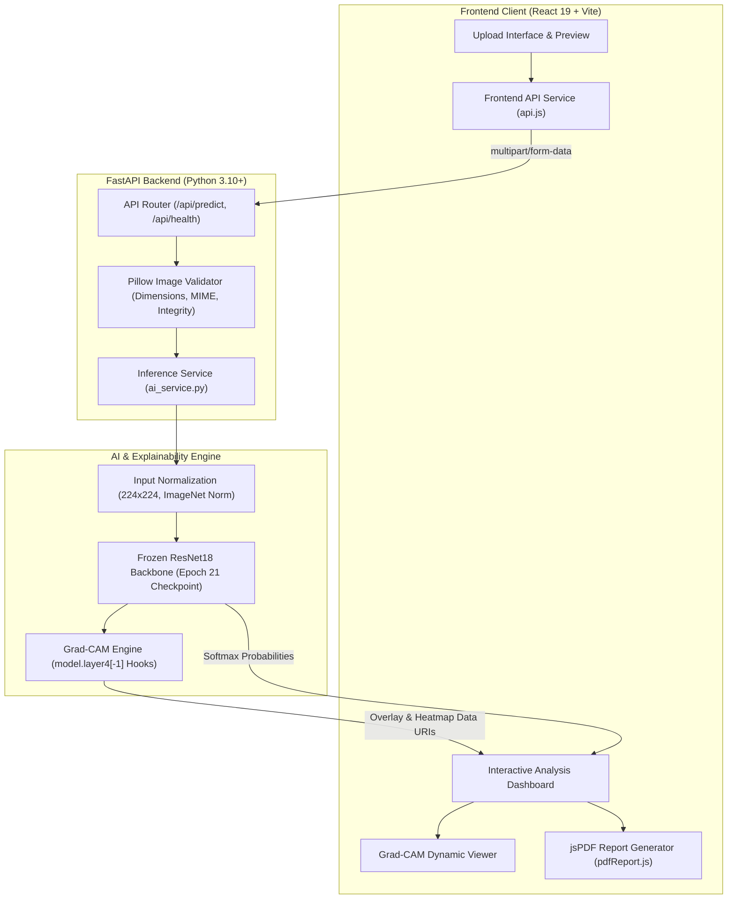

# AI Osteoporosis Prediction System
### Explainable Deep Learning Research Prototype for Knee Radiograph Bone Health Assessment

[](https://www.python.org/)
[](https://pytorch.org/)
[](https://fastapi.tiangolo.com/)
[](https://react.dev/)
[](https://vitejs.dev/)
[](https://ai-osteoporosis-prediction.vercel.app/)
[](https://ai-osteoporosis-prediction-gsk.onrender.com/api/health)
[](LICENSE)

> [!IMPORTANT]
> **ACADEMIC & RESEARCH NOTICE**: This application is strictly an educational and academic research prototype. It is **not a certified medical diagnostic device** (not FDA cleared or CE marked) and does not calculate clinical Dual-energy X-ray Absorptiometry (DXA) Bone Mineral Density (BMD) T-scores. It must never be used as a substitute for professional medical diagnosis, clinical judgment, or patient management.

---

## 1. Project Overview

### 🌐 Live Public Deployments
* **Interactive Web Application**: [https://ai-osteoporosis-prediction.vercel.app/](https://ai-osteoporosis-prediction.vercel.app/)
* **Production REST API**: [https://ai-osteoporosis-prediction-gsk.onrender.com](https://ai-osteoporosis-prediction-gsk.onrender.com)
* **Backend Health Check**: [`https://ai-osteoporosis-prediction-gsk.onrender.com/api/health`](https://ai-osteoporosis-prediction-gsk.onrender.com/api/health)
* **Interactive OpenAPI Docs**: [`https://ai-osteoporosis-prediction-gsk.onrender.com/docs`](https://ai-osteoporosis-prediction-gsk.onrender.com/docs)

The **AI Osteoporosis Prediction System** is an open-source, full-stack deep learning research platform engineered to evaluate bone structural indicators from plain knee X-ray radiographs. Built on a frozen, benchmarked **ResNet18** convolutional backbone, the system classifies input radiographs into three research categories:
1. **Normal Bone Density**
2. **Osteopenia** (Mild-to-moderate bone density attenuation)
3. **Osteoporosis** (Severe bone mineral loss and microarchitectural deterioration)

Beyond classification scores, the platform integrates **genuine Gradient-weighted Class Activation Mapping (Grad-CAM)** to visually highlight the specific trabecular bone and joint space regions influencing neural network representations, and provides structured **PDF research report export** for experimental documentation and model interpretability.

---

## 2. System Architecture



---

## 3. Technology Stack

* **Deep Learning & Explainability**:
  * PyTorch 2.6 (CPU-optimized inference runtime)
  * Torchvision 0.21
  * Thread-safe Grad-CAM hook manager (`scripts/gradcam.py`)
  * OpenCV & Pillow for colormap blending and tensor transformations
* **Backend Services**:
  * FastAPI 0.115 (Asynchronous REST API)
  * Uvicorn (ASGI production server)
  * Pydantic v2 (Strict request/response data contracts)
  * Explicit CORS origin management via `CORS_ORIGINS`
* **Frontend Web Application**:
  * React 19 + Vite 6
  * Modern Vanilla CSS design system (Tailwind-free, glassmorphic dark-mode palette, responsive layouts)
  * Lucide React icons
  * jsPDF with text wrapping, aspect-ratio preservation, and WHO DXA educational reference tables

---

## 4. Model Evaluation & Benchmark Results

The frozen ResNet18 model was selected after rigorous multi-model comparison across Custom CNN, EfficientNet-B0, DenseNet-121, and ResNet-18 architectures on a strictly deduplicated knee radiograph dataset.

### Held-Out Test Evaluation (135 Unseen Knee Radiographs)

| Evaluation Metric | Measured Value | 95% Confidence Interval |
| :--- | :---: | :---: |
| **Overall Accuracy** | **80.74%** (109 / 135) | [73.33%, 87.41%] |
| **Macro Precision** | **0.8077** | [73.72%, 87.22%] |
| **Macro Recall** | **0.8231** | [76.07%, 88.10%] |
| **Macro F1-Score** | **0.8072** | [73.35%, 86.95%] |
| **Macro ROC-AUC** | **0.9174** | — |
| **Expected Calibration Error (ECE)** | **0.0984** | — |

### Per-Class Test Performance

| Class | Precision | Recall (Sensitivity) | Specificity | F1-Score | ROC-AUC | Support |
| :--- | :---: | :---: | :---: | :---: | :---: | :---: |
| **Normal** | 0.9111 | 0.7885 | 0.9518 | **0.8454** | 0.9544 | 52 |
| **Osteopenia** | 0.7500 | 1.0000 | 0.8788 | **0.8571** | 0.9565 | 36 |
| **Osteoporosis** | 0.7619 | 0.6809 | 0.8864 | **0.7191** | 0.8414 | 47 |
| **Macro Total** | **0.8077** | **0.8231** | **0.9057** | **0.8072** | **0.9174** | **135** |

### Authoritative Confusion Matrix

```text
                      Predicted Normal   Predicted Osteopenia   Predicted Osteoporosis   Total
Actual Normal                41                   1                      10                52
Actual Osteopenia             0                  36                       0                36
Actual Osteoporosis           4                  11                      32                47
Total Predicted              45                  48                      42               135
```

---

## 5. Grad-CAM Explainability Methodology

The explainability engine implements genuine Gradient-weighted Class Activation Mapping:
1. **Target Feature Layer**: The final residual block `model.layer4[-1]` (BasicBlock 2, yielding 512 channels at $7 \times 7$ spatial resolution).
2. **Gradient Backpropagation**: Computes the gradients of the unnormalized target class logit $y^c$ with respect to feature activation maps $A^k$:
   $$\alpha_k^c = \frac{1}{Z} \sum_{i} \sum_{j} \frac{\partial y^c}{\partial A_{i,j}^k}$$
3. **Rectified Linear Combination**: Generates the coarse localization map by linearly combining activation maps weighted by $\alpha_k^c$ and applying ReLU to capture positive contributing features:
   $$L_{\text{Grad-CAM}}^c = \text{ReLU}\left(\sum_k \alpha_k^c A^k\right)$$
4. **Colormap Blending**: Normalizes activations to $[0, 1]$, resizes to $224 \times 224$ via bilinear interpolation, maps to the OpenCV `JET` colormap, and alpha-blends ($\alpha = 0.45$) over the input radiograph.

> [!NOTE]
> Grad-CAM activations indicate regions that strongly influenced convolutional feature extraction. They do **not** constitute medically verified segmentations of diseased tissue or physical bone mineral loss.

---

## 6. Local Installation & Setup

### Prerequisites
* **Python 3.10+** (64-bit)
* **Node.js 18+** and **npm**

### Step 1: Clone Repository
```bash
git clone https://github.com/karthi-gsk/ai-osteoporosis-prediction.git
cd ai-osteoporosis-prediction
```

### Step 2: Backend Setup
```bash
cd backend

# Create and activate virtual environment
python -m venv venv
# On Windows:
.\venv\Scripts\Activate.ps1
# On Linux/macOS:
source venv/bin/activate

# Install CPU-only dependencies
pip install -r requirements-cpu.txt
```

### Step 3: Checkpoint Verification
Confirm the frozen ResNet18 checkpoint is present and valid:
```bash
python scripts/download_checkpoint.py
```
*Expected SHA-256:* `6ccc18b8b71b4bd3d81740aeb9be48271ae24aef119fd0d37801362017aa8faa`

### Step 4: Frontend Setup
```bash
cd ../frontend
npm install
```

### Step 5: Run Application Locally
* **Terminal 1 (Backend)**:
  ```bash
  python -m uvicorn backend.main:app --host 127.0.0.1 --port 8000 --reload
  ```
  API Docs (Swagger): `http://127.0.0.1:8000/docs`
* **Terminal 2 (Frontend)**:
  ```bash
  cd frontend
  npm run dev
  ```
  Frontend Dashboard: `http://localhost:5173`

---

## 7. Production Deployment Configuration

### Frontend Environment Variables
Set the backend API URL in your hosting environment (e.g. Vercel, Netlify, Cloudflare Pages):
```env
VITE_API_BASE_URL=https://your-backend-api.onrender.com
```
*(Note: `VITE_API_URL` is also supported as an alias).*

### Backend Environment Variables
Configure the following environment variables in your backend hosting service (e.g. Render, Google Cloud Run, AWS ECS):

| Variable | Example Value | Description |
| :--- | :--- | :--- |
| `PORT` | `8000` | Port on which FastAPI Uvicorn server listens (set automatically by Render/Cloud Run) |
| `HOST` | `0.0.0.0` | Network binding host address |
| `ENV` | `production` | Environment mode (`production` disables auto-reload) |
| `CORS_ORIGINS` | `https://your-frontend.vercel.app` | **Required in production.** Comma-separated list of exact allowed frontend origins. Avoid wildcard `*` in production. |
| `MODEL_CHECKPOINT_PATH` | `/app/models/.../best_model.pth` | Absolute or relative path to frozen `best_model.pth` |
| `CHECKPOINT_DOWNLOAD_URL` | `https://github.com/.../best_model.pth` | Direct URL to download checkpoint on container boot if not baked into the image |

### Building and Running with Docker
```bash
# Build production Docker container from repository root
docker build -f backend/Dockerfile -t osteoporosis-ai-backend .

# Run container with production settings
docker run -d -p 8000:8000 \
  -e PORT=8000 \
  -e CORS_ORIGINS="https://your-frontend.vercel.app" \
  -e CHECKPOINT_DOWNLOAD_URL="https://github.com/<USER>/<REPO>/releases/download/v1.0.0/best_model.pth" \
  --name osteoporosis-api osteoporosis-ai-backend
```

---

## 8. Academic Research & Clinical Limitations

1. **Anatomical & Projection Scope**: This system was trained and evaluated **exclusively on Anteroposterior (AP) plain knee radiographs** (Mendeley Data DOI: [10.17632/fxjm8fb6mw.2](https://data.mendeley.com/datasets/fxjm8fb6mw/2)). It does NOT support lateral knee projections, lumbar spine, hip, femoral neck, or other anatomical regions.
2. **Not a DXA Replacement**: Dual-energy X-ray Absorptiometry (DXA) remains the clinical gold standard for measuring areal Bone Mineral Density ($g/cm^2$) and establishing diagnostic T-scores. This CNN estimates visual radiograph features and does not measure physical density.
3. **Probabilistic Outputs**: Softmax scores represent mathematical category distribution over the training manifold, not absolute calibrated probabilities of disease prevalence.
4. **Grad-CAM Interpretation**: Activation heatmaps denote neural network feature correlation. They do not constitute anatomical segmentations of osteoporotic lesions.
5. **Sample Size & Variance**: The held-out test evaluation was conducted on 135 strictly isolated knee radiographs. Clinical validation across diverse demographic populations and imaging hardware is required before any translational application.
6. **Dataset Attribution**: Trained using knee radiographic data derived from the Mendeley Data Knee X-ray Osteoporosis Database (DOI: [10.17632/fxjm8fb6mw.2](https://data.mendeley.com/datasets/fxjm8fb6mw/2)), distributed under Creative Commons Attribution 4.0 International (CC BY 4.0). Note that 76.5% of images in the source dataset lack explicit patient identifiers and rely on original repository classifications.

---

## 9. License

This project is licensed under the MIT License — see the [LICENSE](LICENSE) file for details.
