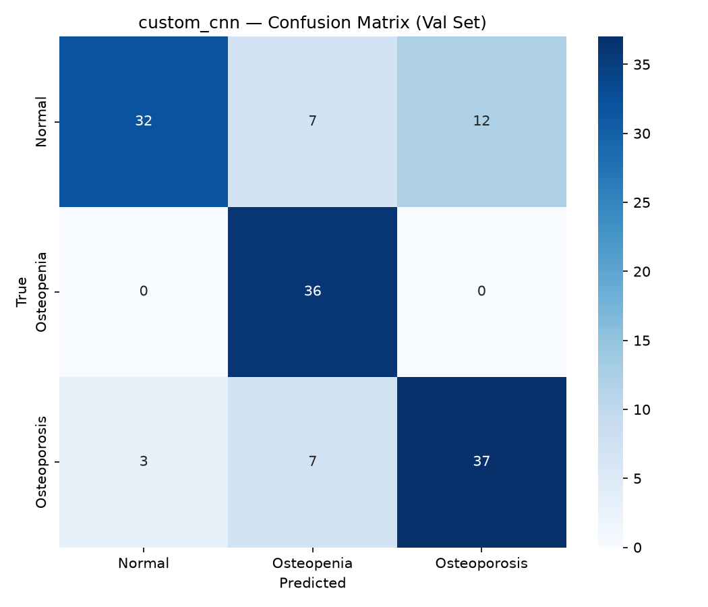
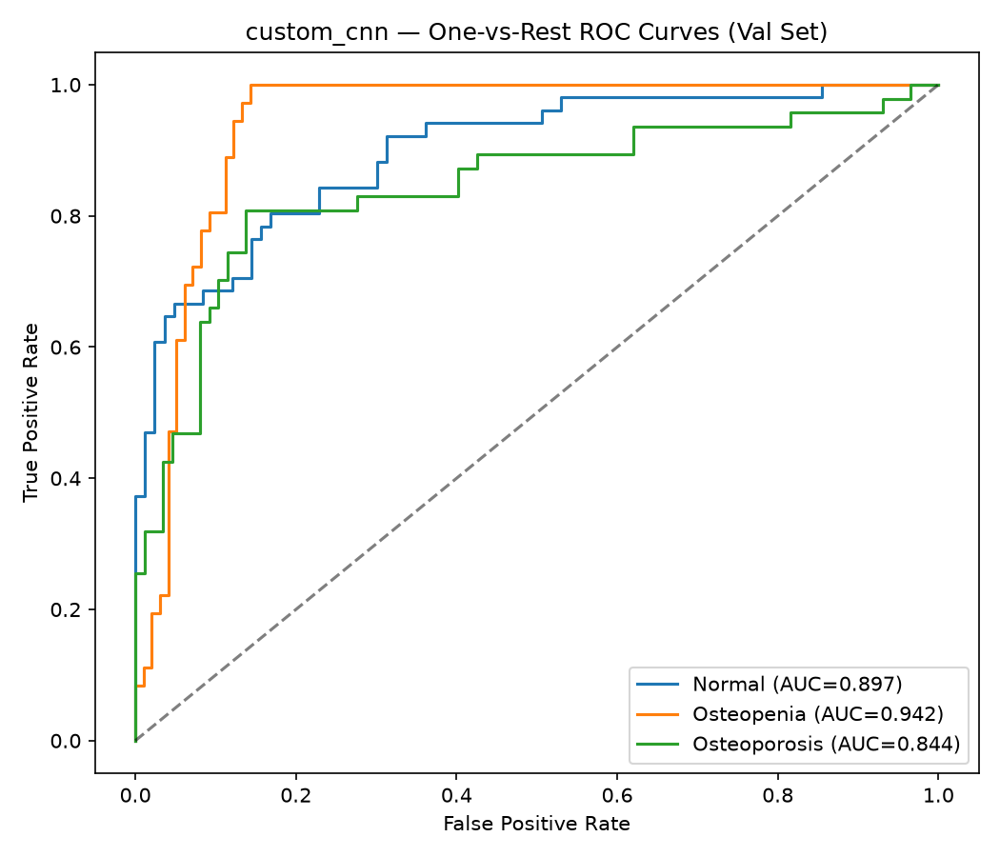
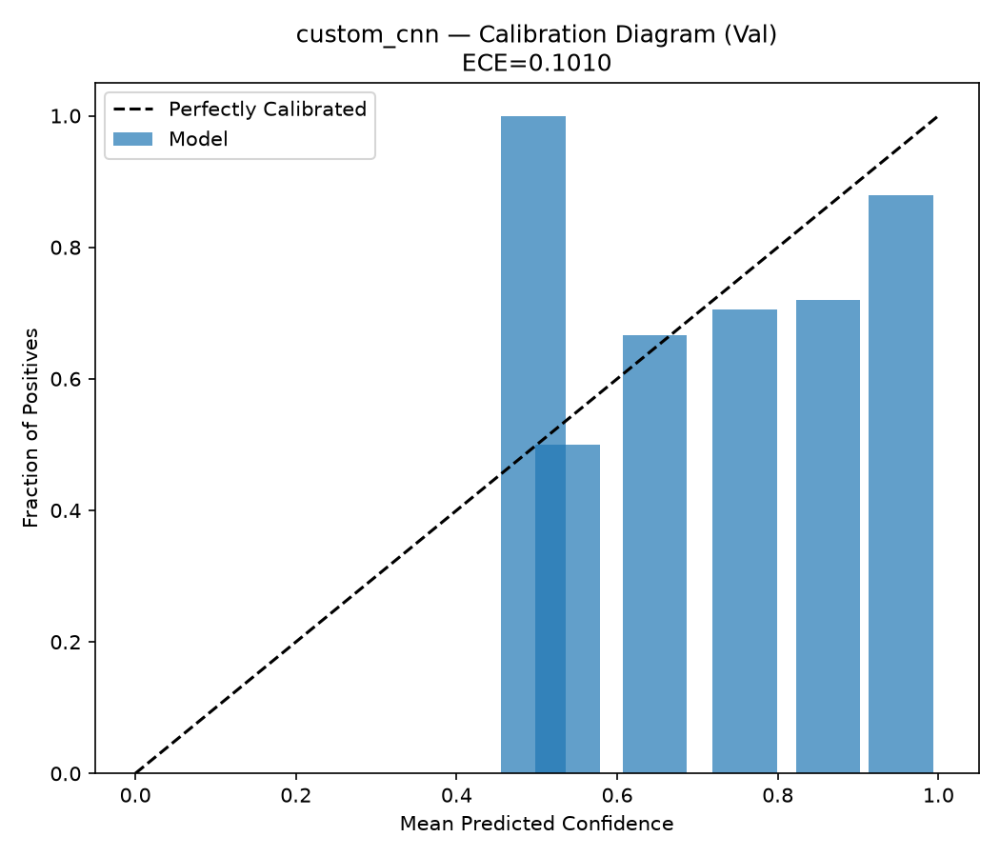

# custom_cnn — Val Evaluation Report

**Date:** 2026-09-24  
**Split evaluated:** `val` (n=134)  
**Epochs trained:** 35  
**Best validation F1:** 0.7841

## Results Summary

| Metric | Value | 95% CI |
|:---|:---:|:---:|
| Accuracy | 0.7836 | [0.7164, 0.8582] |
| Macro Precision | 0.7965 | [0.7312, 0.8622] |
| Macro Recall | 0.8049 | [0.7468, 0.8655] |
| Macro F1 | 0.7841 | [0.7142, 0.8522] |
| ROC-AUC (macro) | 0.8942 | — |
| ECE | 0.1010 | — |

## Per-Class Performance

| Class | Sensitivity | Specificity | ROC-AUC | Support |
|:---|:---:|:---:|:---:|:---:|
| Normal | 0.6275 | 0.9639 | 0.897 | 51 |
| Osteopenia | 1.0000 | 0.8571 | 0.9419 | 36 |
| Osteoporosis | 0.7872 | 0.8621 | 0.8437 | 47 |

## Confusion Matrix

## ROC Curves

## Calibration

