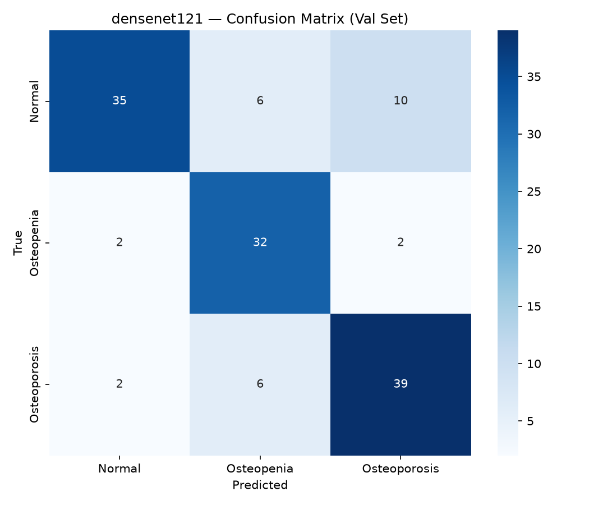
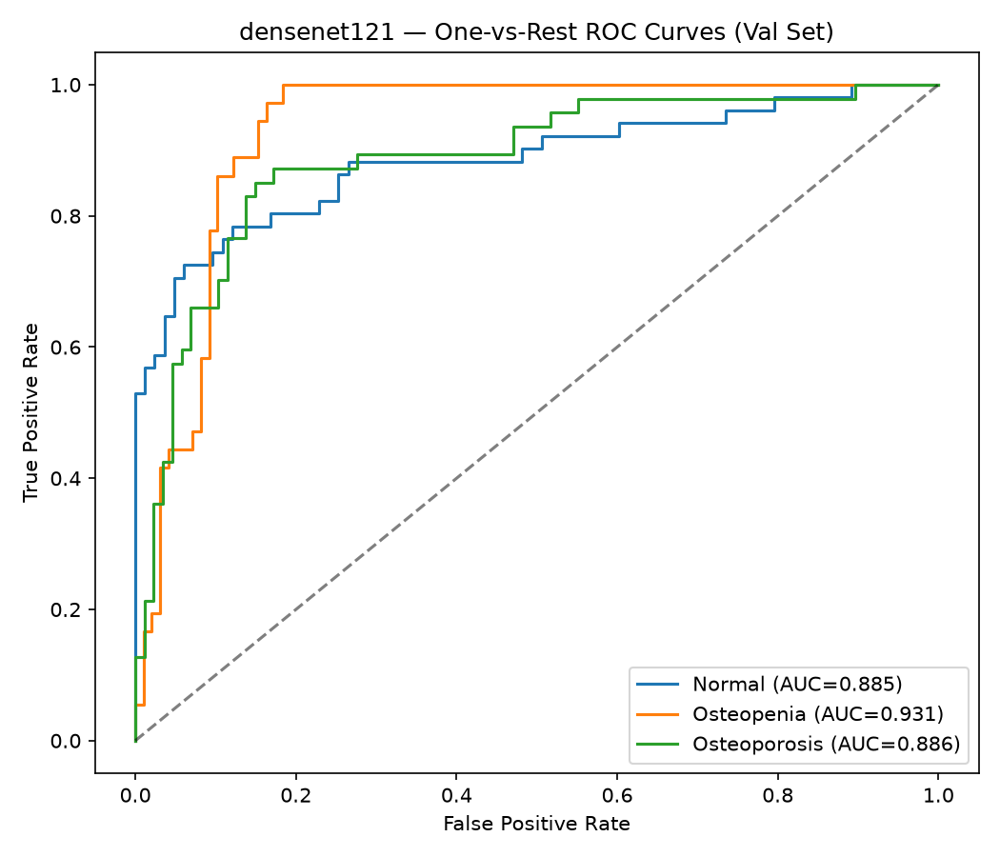
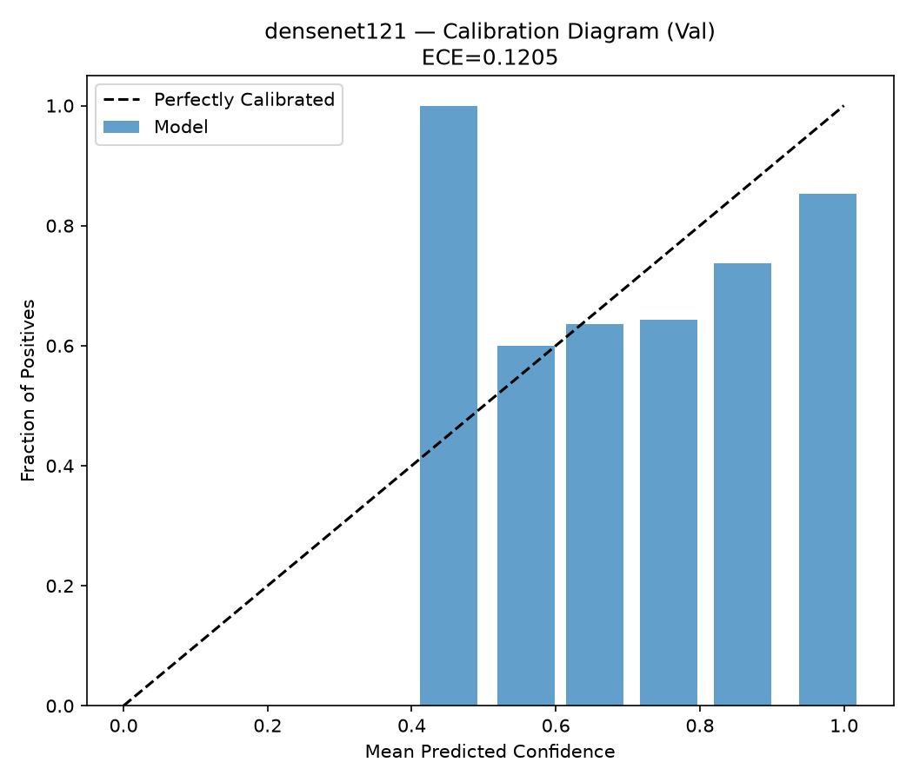
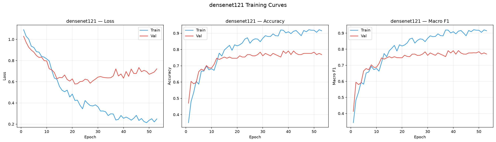

# densenet121 — Val Evaluation Report

**Date:** 2026-09-25  
**Split evaluated:** `val` (n=134)  
**Epochs trained:** 53  
**Best validation F1:** 0.7912

## Results Summary

| Metric | Value | 95% CI |
|:---|:---:|:---:|
| Accuracy | 0.7910 | [0.7312, 0.8582] |
| Macro Precision | 0.7965 | [0.7336, 0.8616] |
| Macro Recall | 0.8017 | [0.7401, 0.8649] |
| Macro F1 | 0.7912 | [0.7234, 0.8584] |
| ROC-AUC (macro) | 0.9007 | — |
| ECE | 0.1205 | — |

## Per-Class Performance

| Class | Sensitivity | Specificity | ROC-AUC | Support |
|:---|:---:|:---:|:---:|:---:|
| Normal | 0.6863 | 0.9518 | 0.885 | 51 |
| Osteopenia | 0.8889 | 0.8776 | 0.9314 | 36 |
| Osteoporosis | 0.8298 | 0.8621 | 0.8858 | 47 |

## Confusion Matrix

## ROC Curves

## Calibration

## Training Curves

