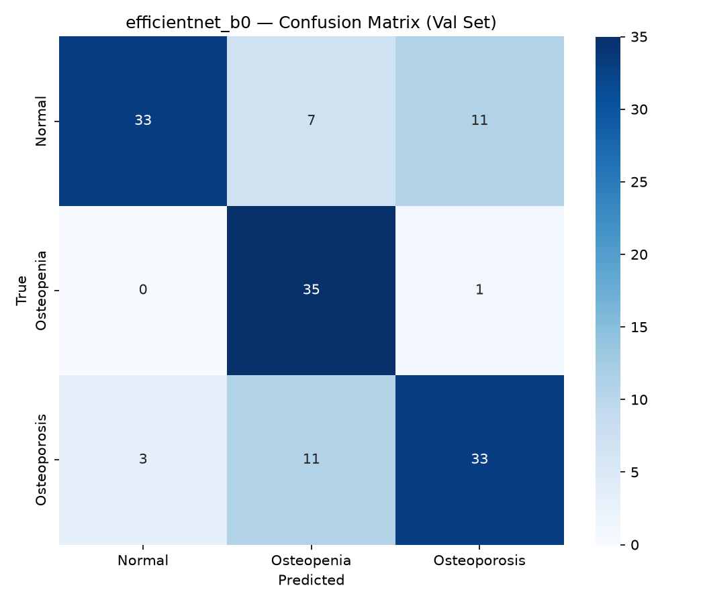
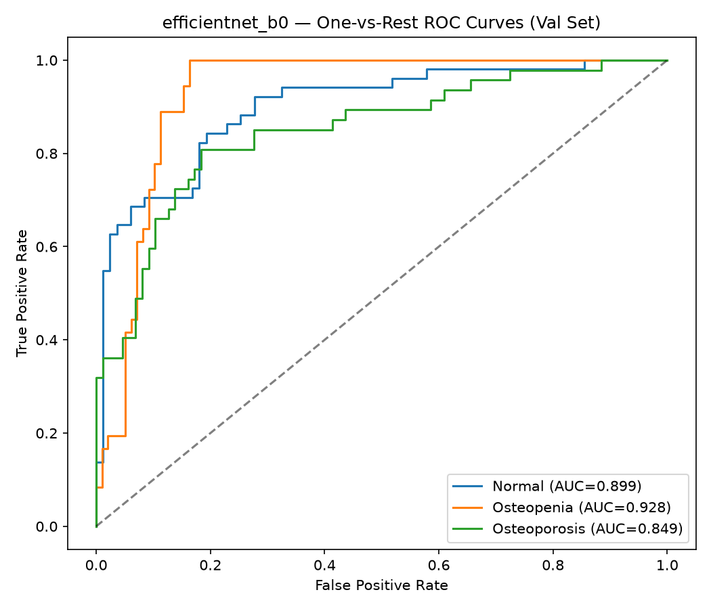
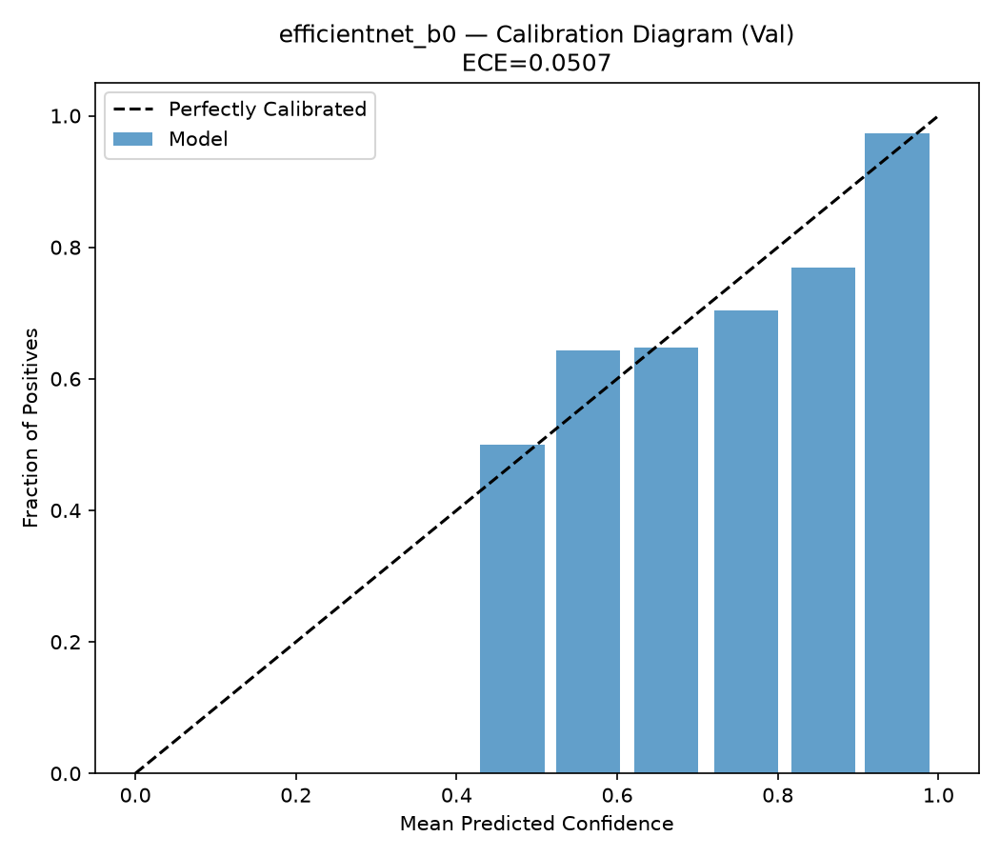
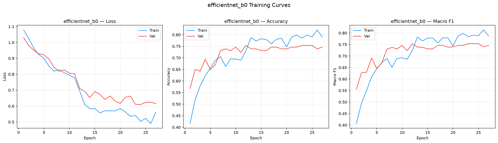

# efficientnet_b0 — Val Evaluation Report

**Date:** 2026-09-24  
**Split evaluated:** `val` (n=134)  
**Epochs trained:** 27  
**Best validation F1:** 0.7542

## Results Summary

| Metric | Value | 95% CI |
|:---|:---:|:---:|
| Accuracy | 0.7537 | [0.6791, 0.8284] |
| Macro Precision | 0.7701 | [0.7012, 0.8386] |
| Macro Recall | 0.7738 | [0.7065, 0.8385] |
| Macro F1 | 0.7542 | [0.6745, 0.8257] |
| ROC-AUC (macro) | 0.8919 | — |
| ECE | 0.0507 | — |

## Per-Class Performance

| Class | Sensitivity | Specificity | ROC-AUC | Support |
|:---|:---:|:---:|:---:|:---:|
| Normal | 0.6471 | 0.9639 | 0.8987 | 51 |
| Osteopenia | 0.9722 | 0.8163 | 0.928 | 36 |
| Osteoporosis | 0.7021 | 0.8621 | 0.8491 | 47 |

## Confusion Matrix

## ROC Curves

## Calibration

## Training Curves

