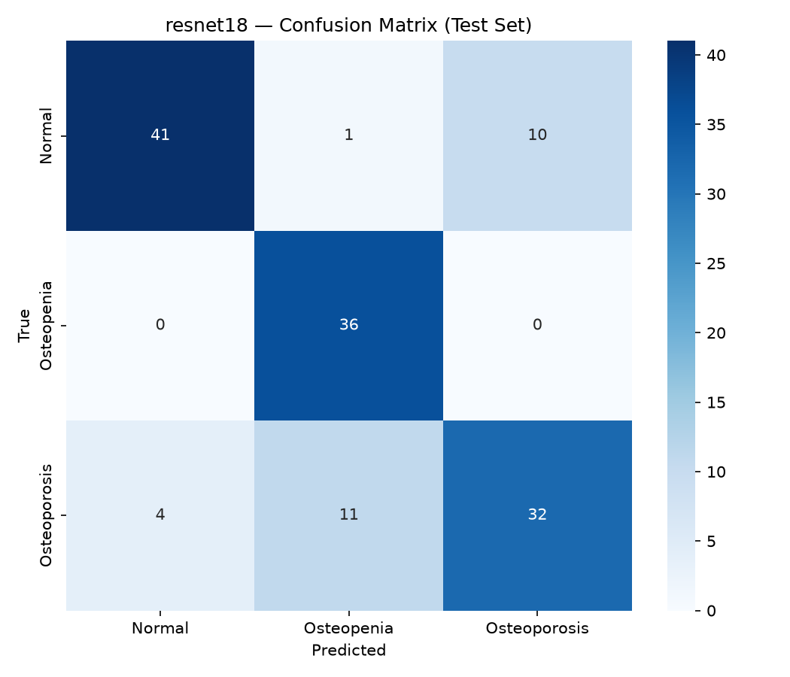
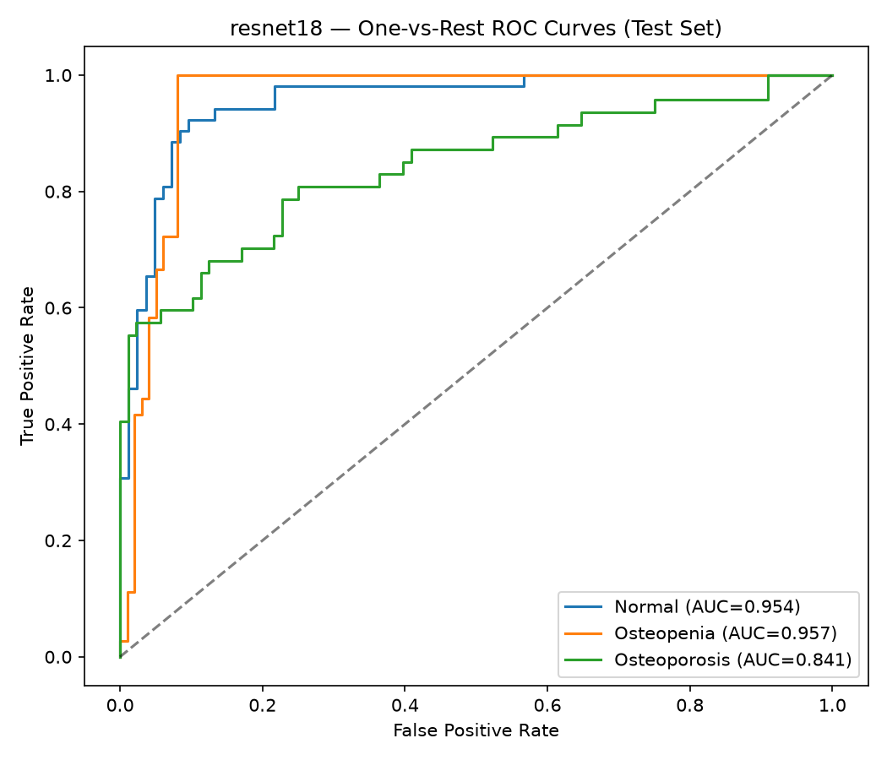
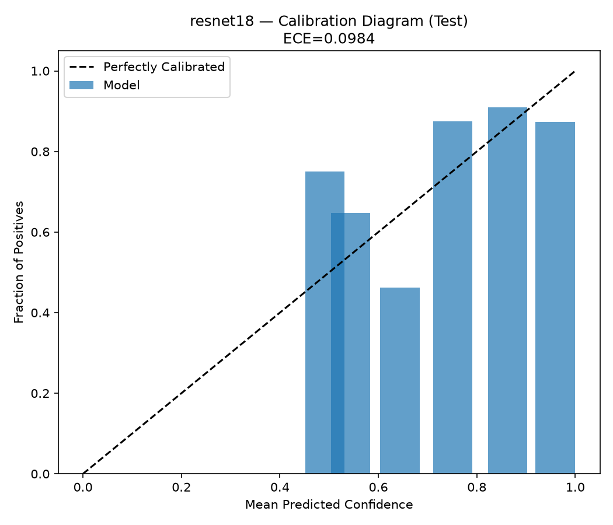
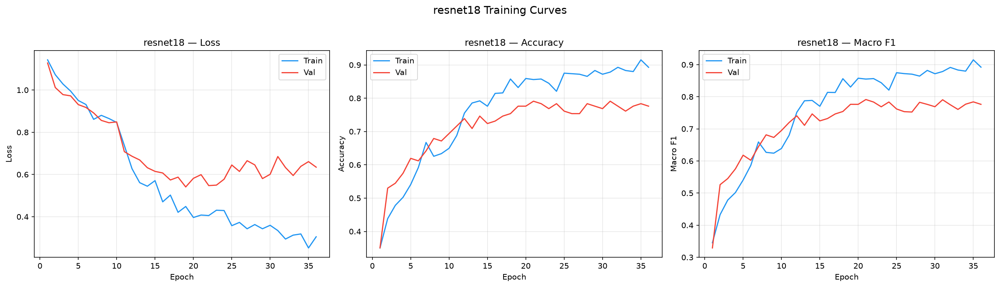

# resnet18 — Test Evaluation Report

**Date:** 2026-09-25  
**Split evaluated:** `test` (n=135)  
**Epochs trained:** 36  
**Best validation F1:** 0.7913

## Results Summary

| Metric | Value | 95% CI |
|:---|:---:|:---:|
| Accuracy | 0.8074 | [0.7333, 0.8741] |
| Macro Precision | 0.8077 | [0.7372, 0.8722] |
| Macro Recall | 0.8231 | [0.7607, 0.881] |
| Macro F1 | 0.8072 | [0.7335, 0.8695] |
| ROC-AUC (macro) | 0.9174 | — |
| ECE | 0.0984 | — |

## Per-Class Performance

| Class | Precision | Recall (Sensitivity) | Specificity | F1-Score | ROC-AUC | Support |
|:---|:---:|:---:|:---:|:---:|:---:|:---:|
| Normal | 0.9111 | 0.7885 | 0.9518 | 0.8454 | 0.9544 | 52 |
| Osteopenia | 0.75 | 1.0000 | 0.8788 | 0.8571 | 0.9565 | 36 |
| Osteoporosis | 0.7619 | 0.6809 | 0.8864 | 0.7191 | 0.8414 | 47 |

> [!NOTE]
> **Dataset & Clinical Disclaimer:**
> Evaluation performed on test split of `strict_clean_knee_osteoporosis` (n=135).
> 76.5% of images in the source dataset lack patient IDs and rely on unverified folder placement.
> Model confidences are research estimates and are not clinically validated diagnostic probabilities.

## Confusion Matrix

## ROC Curves

## Calibration

## Training Curves

