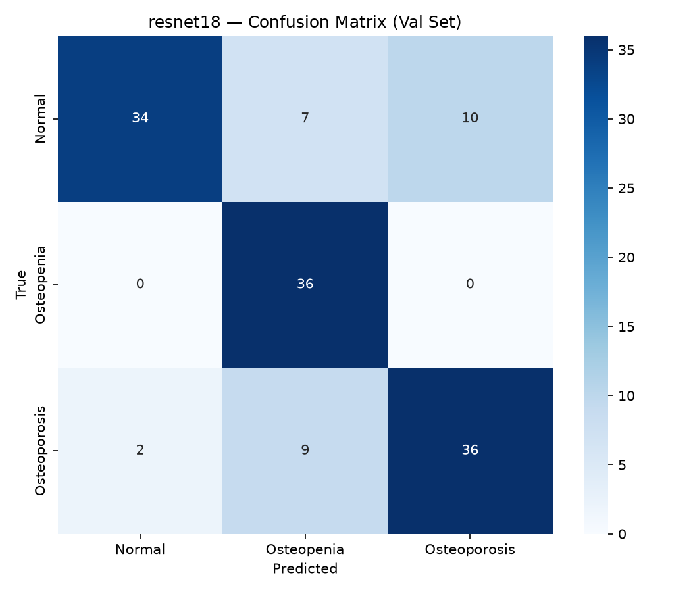
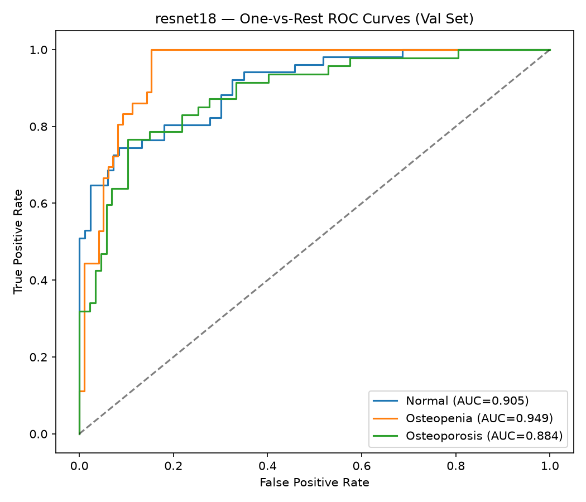
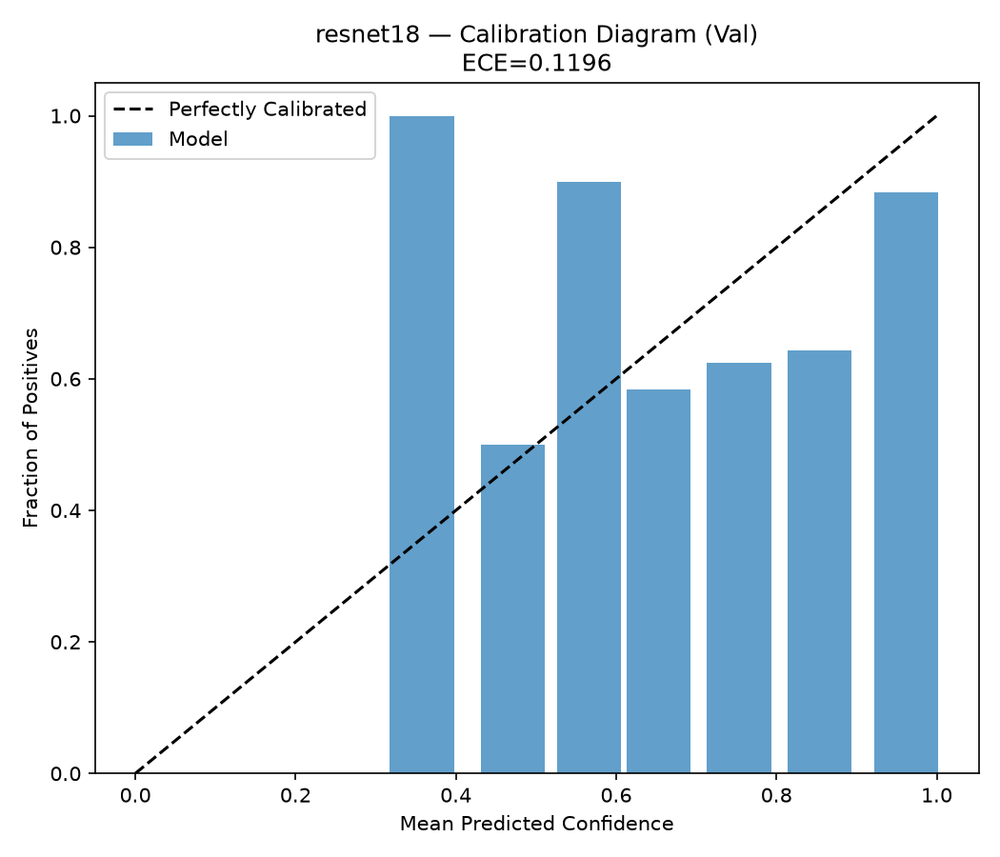

# resnet18 — Val Evaluation Report

**Date:** 2026-09-24  
**Split evaluated:** `val` (n=134)  
**Epochs trained:** 36  
**Best validation F1:** 0.7913

## Results Summary

| Metric | Value | 95% CI |
|:---|:---:|:---:|
| Accuracy | 0.7910 | [0.7239, 0.8582] |
| Macro Precision | 0.8065 | [0.7406, 0.8702] |
| Macro Recall | 0.8109 | [0.7505, 0.8675] |
| Macro F1 | 0.7913 | [0.7206, 0.859] |
| ROC-AUC (macro) | 0.9127 | — |
| ECE | 0.1196 | — |

## Per-Class Performance

| Class | Sensitivity | Specificity | ROC-AUC | Support |
|:---|:---:|:---:|:---:|:---:|
| Normal | 0.6667 | 0.9759 | 0.905 | 51 |
| Osteopenia | 1.0000 | 0.8367 | 0.949 | 36 |
| Osteoporosis | 0.7660 | 0.8851 | 0.8841 | 47 |

## Confusion Matrix

## ROC Curves

## Calibration

## Training Curves

